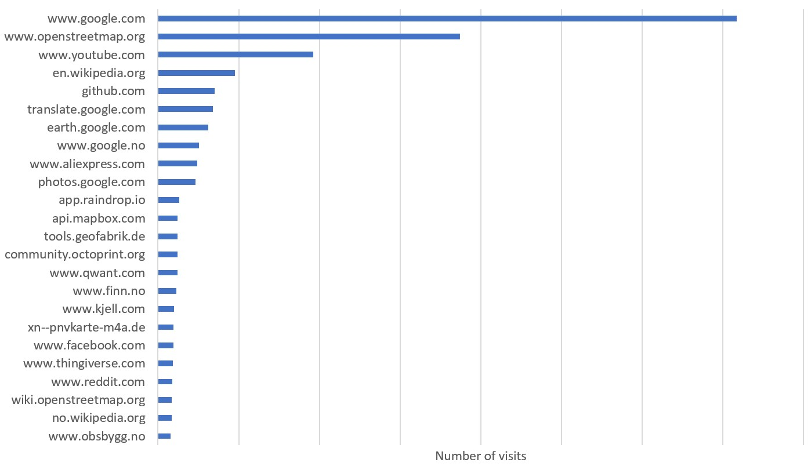
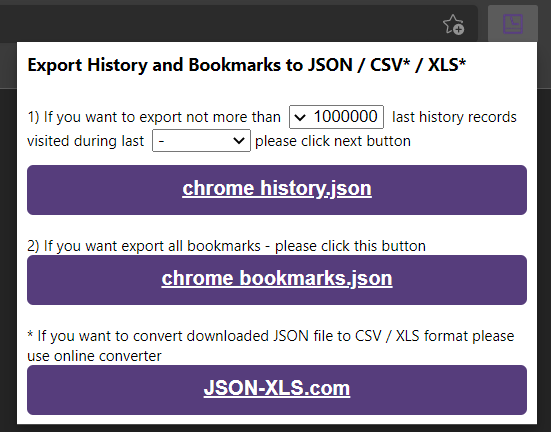

# Chromium history parser

This is a python script that sorts your browsing history based on the number of website visits. It exports the results to a csv file, which means you can really easily make charts like the one below. It also supports filtering. For example, you can choose to omit all websites with fewer than 50 entries. This prevents the output file from being insanely long. 

## How to use:
1) Clone the repository. Save the `chromium-history-parser-master` folder to a known location. 
2) Install the [Export History/Bookmarks to JSON/CSV*/XLS*](https://chrome.google.com/webstore/detail/export-historybookmarks-t/dcoegfodcnjofhjfbhegcgjgapeichlf) chrome extension. This is used to actually export the browsing history. AFAIK, there is no native option for this in Edge, nor any alternative for firefox or other non-chromium-based browsers. 
3) Open the extension, and export as many history entries as possible. A downside of this extension is that there is a limit to how many entries you can export. 
4) Move the `chrome_history.json` file you just downloaded to the `chromium-history-parser-master` folder. 
5) Run the python script, and follow instructions. 
6) You will now have a file called `rank.csv` together with the other files. Enjoy!